<style>
.column-left3{
  float: left;
  width: 33%;
  text-align: left;
}
.column-center3{
  display: inline-block;
  width: 33%;
  text-align: center;
}
.column-right3{
  float: right;
  width: 33%;
  text-align: right;
}
.column-left2{
  float: left;
  width: 50%;
  text-align: left;
}
.column-right2{
  float: right;
  width: 50%;
  text-align: left;
}
</style>

```{r setup, include=FALSE}
knitr::opts_chunk$set(echo = FALSE)
```

# Hi!

## Daniel Chen

Computational. Network. Epidemiology.

## About Me

- PhD Student at Virginia Tech
    - Interdisciplinary
    - [Genetics, Bioinformatics, and Computational Biology][1]

- [Social and Decision Analytics Laboratory][2]
    - Arlington, VA

- MPH, Epidemiology, Mailman School of Public Health
    - STATW4242: Introduction to Data Science, Fall 2013
        - [Kayur Patel, PhD][3]
        - [Rachel Rosenthal Schutt, PhD][4]
        - [Jared Lander, MS][5]

## Teach

- [Software Carpentry][6] / [Data Carpentry][7], 2014
    - Bash/Git/Python/R/SQL
    - OpenRefine
    - Many workshops...
- [Lander Analytics][8]
    - R/Python/Shiny
- [Data Science for the Public Good Program][16]
    - [https://github.com/bi-sdal/workshop][17]
    - [rstats.nyc 2017][18]

## Published Teaching

- [Git Essentials][9], Safari Books Online
- [Cleaning Data in Python][10], DataCamp
- Writing: [Pandas for Everyone][11], Pearson, Addison-Wesley Data and Analytics
- Workshop Recordings
    - [PyData][13]
    - [Data Intensive Biology][12]

# Current Work

## Modeling Attitude Diffusion

- [IBSS: Understanding Social Diffusion Dynamics Among Networked Cognitive Systems][15]
    - National Science Foundation
    - Interdisciplinary Behavioral and Social Science Research

## Modeling

(Computational) (Infectious) Disease Modeling

Two main types of models:

1. Compartmental/Mathematical/System Dynamics/ Ordinary Differential Equation (ODE) Models
2. Agent-Based Models (ABM)

## Compartmental Models

<div class="column-left2">
SIR Models

- **S**usceptible
- **I**nfectious
- **R**ecovered

$$
\begin{align*}
    \frac{dS}{dt} &= -b S(t) I(t)\\
    \frac{dI}{dt} &= b S(t) I(t) - kI(t)\\
    \frac{dR}{dt} &= k I(t)
\end{align*}
$$

</div>
<div class="column-right2">

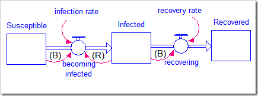

[ISEE Systems - Stella][19]

</div>

## Compartmental Models

<div class="column-left2">

- SIS
- SEIR
- MSIR
- SI(CR)
- Vaccine

</div>
<div class="column-left2">
Pros

- Deterministic
- Overall System Dynamics
- Homogeneous (random mixing)
- Simple, easy to set up

Cons

- Not stochastic
- No individual level behaviors
- No complex interactions

</div>

## Agent-Based Models

- The model is composed of individual 'agents'
- Each agent has a set of rules
- The agents repeat these rules (ticks/cycles)

- Observe complex system dynamics from the bottom-up through **emergence**

## Agent-Based Models

<div class="column-left2">

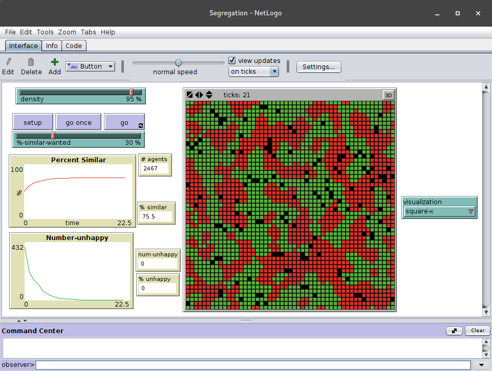

Segregation

</div>
<div class="column-right2">

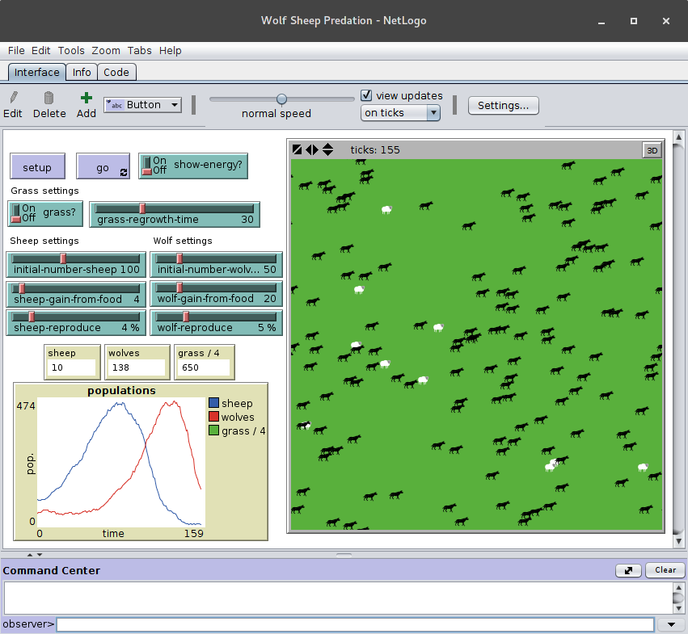

Wolf Sheep Predation

</div>

## Agent-Based Models

<div class="column-left2">

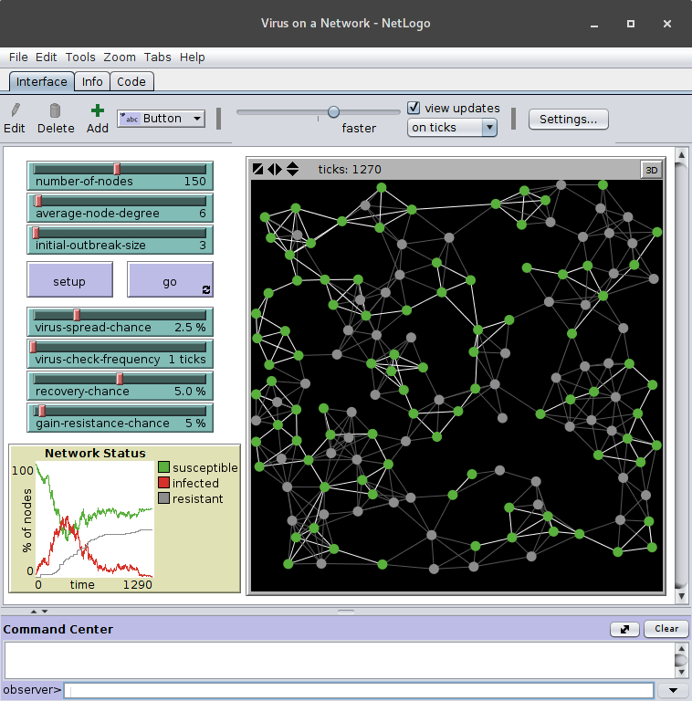

Virus on a Network

</div>
<div class="column-right2">
<center>
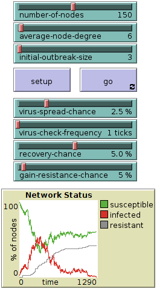
</center>

</div>

## Agent-Based Models

<div class="column-left2">
Pros

- Stochastic
- Consolidate knowledge for agent rules/behaviors
- Heterogeneous

</div>

<div class="column-right2">
Cons

- Needs a lot of data and time to set up
- Harder to get general system dynamics
- Needs a lot of model runs
- Resource-intensive

</div>

## CMs to ABMs

<center>
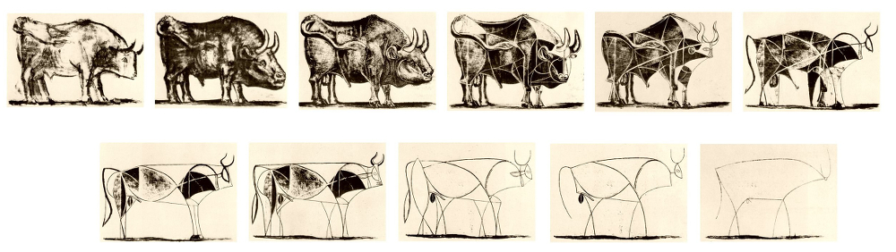

Pablo Picasso, "Bull", Plates 1-11 (Lithograph)
</center>

## (Duncan) Watts Model

Watts 2002: *A simple model of global cascades on random networks*

- Binary Decisions with Externalities (general contagion model)
    - fads, riots, crime, competing technologies, spread of innovation, conventions, and cooperation
- Probability of a global cascade from a single node
- Local dependencies, fractional threshold, and heterogeneity

## Definitions

- **Cascades**: event of any size triggered by an initial seed
- **Global cascades**: a cascade that occupies a finite fraction of an infinite network. A sufficiently large cascade.
More than a fixed fraction of a large, but finite network.
- **Local dependencies**: agents will incorporate information about its neighbors
- **Fractional threshold**: agents themselves a threshold that determine how it incorporates information from its neighbors
- **Heterogeneity**: every agent is different to varying degree from one another


## Analogy from the paper

Diffution of Innovations:

- Innovators ~ initial seed
- Early adopters ~ vulnerable nodes

- A cascade will occur if innovators are connected to many early adopters (**connectivity**)
- More early adopters, higher chance of innovation, but they need to be connected (**structure**)

## Simulation

- $n$ agents in a network start off with a state of $0$
- Individual agents can only have a state that is either $0$ or $1$
- Each agent has $k$ neighbors
- An agent gets a new state of $1$ if a fraction of its neighbors, $\phi$, are also $1$
    - Otherwise an agent gets a new state of $0$
- During each time step, the population evolves:
    - Update states in random, asynchronous order using the threshold rule
    - Once an agent has a state of $1$, it will stay at $1$ for the remainder of the simulation

<hr>

$\phi$ and $k$ are 2 parameters we can change

## Simulation Parameterization

- $\phi$ and $k$ may be heterogeneous
    - To simplify the simulations, the paper has a homogeneous threshold, $\phi$
- The network is a uniform random graph
- A small seed
- Any pair of nodes is connected with probability $p = \frac{z}{n}$
    - in a uniform random graph, $p_k = $ Poisson distribution
- $n = 10,000$
- 100 random runs of each simulation

## Watts Threshold

<center>
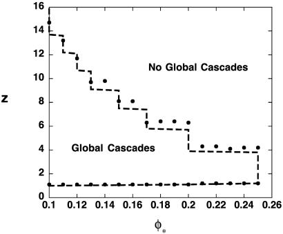
</center>

## Replication Study

https://github.com/chendaniely/gbcb_seminar_presentation_1/raw/master/figures/p_flipped_all.png

## Replication Study

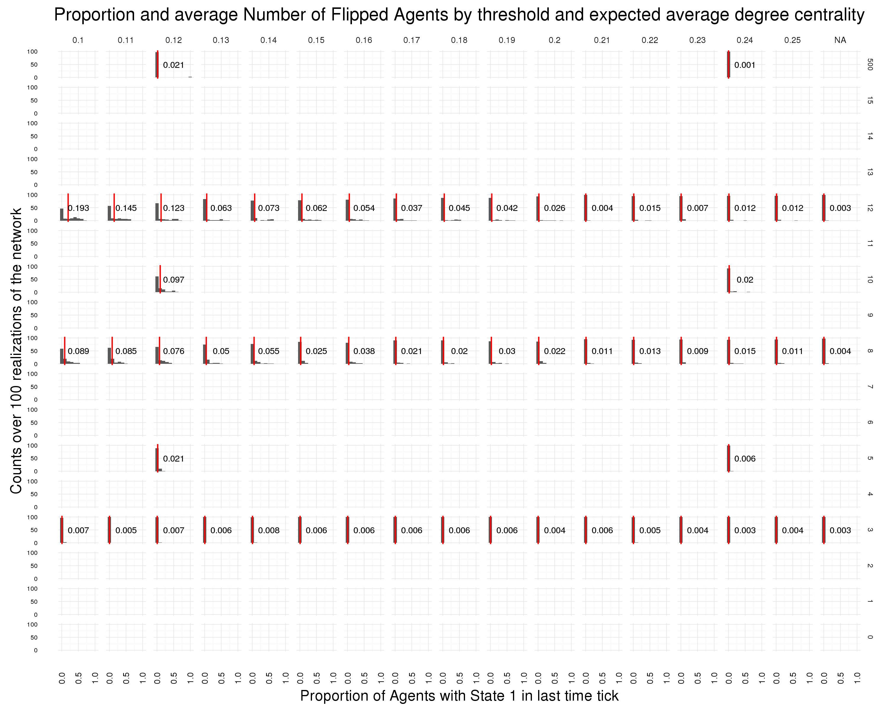

## Expand the Watts Model

The Watts model can be used to model any **binary outcome**

From a **public health** and **epidemiology** perspective, 
this outcome can be a particular **behavior or action**.

- I ate a cookie.  Yes/No

However, our decision making process is not that simple.

## Theory of Reasoned Action (TRA)

TRA Health behavior model

- Martin Fishbein and Icek Ajzen 1967
- Behavior is determined by an individual's intention
- Intention comes from an individual's attitudes and social context
- Attitudes and social context originates from a set of beliefs

beliefs $\rightarrow$ (attitudes & social context) $\rightarrow$ intention $\rightarrow$ behavior

## Neural Networks

<div class="column-left2">
- Feed-forward
- **Recurrent**
- Convolutional

<hr>

- Psychological plausible decisions
    - social processes
    - experience/ memory
    - influences/ dynamic
</div>

<div class="column-right2">
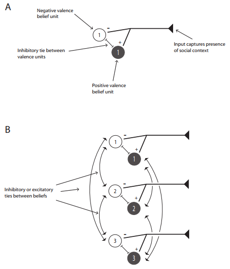

<center>Orr 2014 Figure 1</center>
</div>

## TRA as Parallel Constraint Satisfaction 

<div class="column-left2">
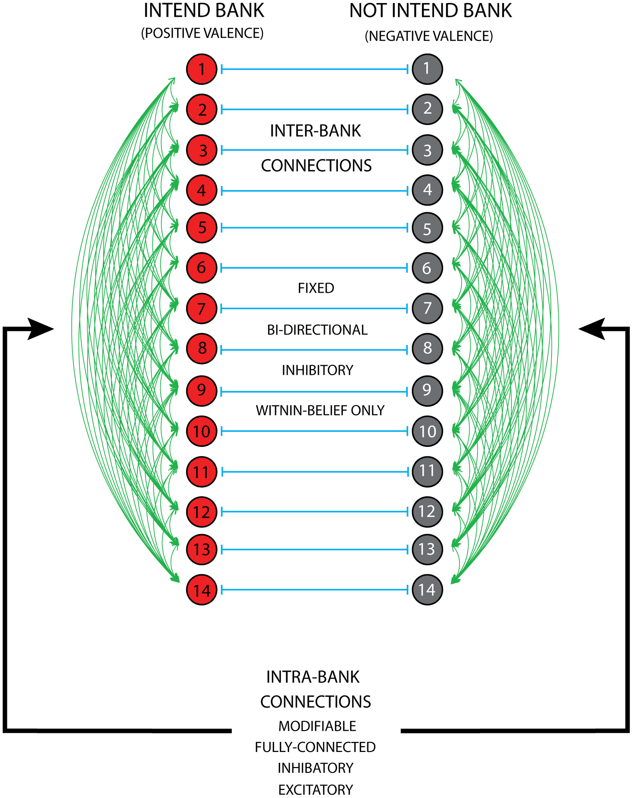
<center>Orr 2013 Figure 1</center>
</div>


<div class="column-right2">
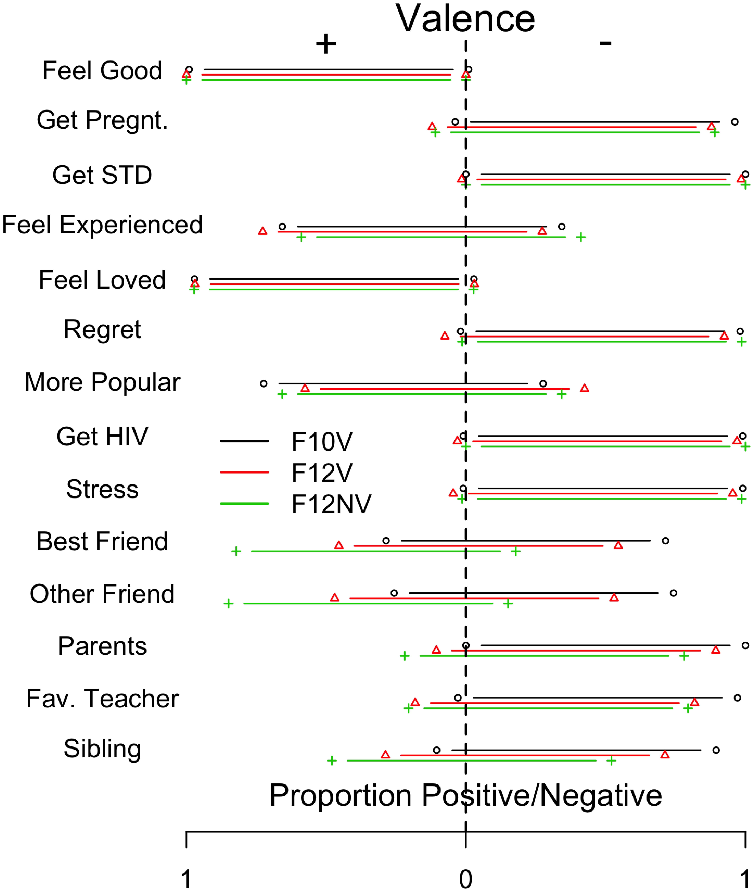

<center>Orr 2013 Figure 2</center>
</div>

## Results

<div class="column-left2">
<center>
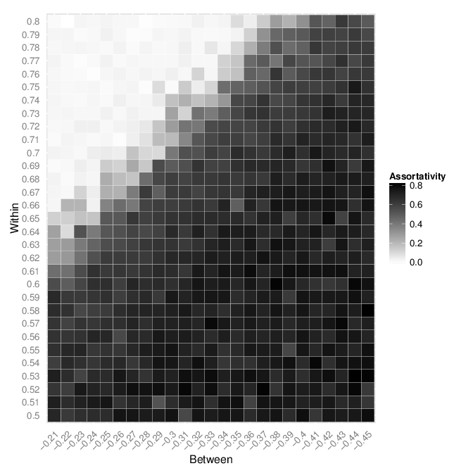
</center>
</div>

<div class="column-right2">
- parameter sweep on NN connections
- no learning during simulation
- 7750 Simulations
- associativity
    - clustering of intention at the end of the simulation
</div>

## Future

- Election 'Fake News'
- NYT: Shooting Scares Show a Nation Quick to Fear the Worst

Questions:
- How to summarize the NN Simulation data
- Signal Decomposition/analysis
- Projections (t-sne)

# (Relevant?) Past Work

## Wicer EntiCE3

<div class="column-left2">
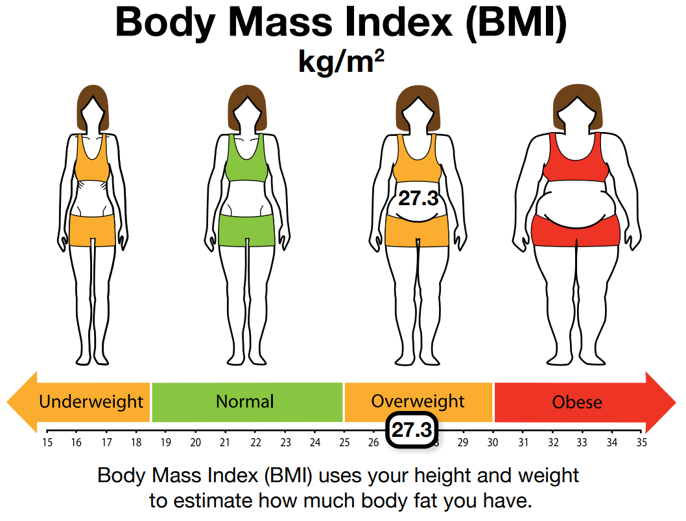
</div>

<div class="column-right2">
- Adriana Arcia, Mark Velez, Suzanne Bakken
- Niurka Suero-Tejeda, Amenda Almonte
- Programatically generate infographics
- Improve health literacy
</div>

- https://github.com/chendaniely/wicer-entice3

Main Lesson: Running software for non-technical people (shiny?)

## Mass Casualty

- 2014: Mass fatality preparedness among medical examiners/coroners in the United States: a cross-sectional study
    - Robyn RM Gershon, Mark G Orr, Qi Zhi, Jacqueline A Merrill, Daniel Y Chen, Halley EM Riley, and Martin F Sherman
- 2015: Are We Ready for Mass Fatality Incidents? Preparedness of the US Mass Fatality Infrastructure
    - Jacqueline A. Merrill, Mark Orr, Daniel Y. Chen, Qi Zhi, and Robyn R. Gershon

Main Findings: "The sectors in the US mass fatality infrastructure report suboptimal capability to respond.
National leadership is needed..."

Lessons Learned: Data quality governs analysis

## Patterns of Care: Congestive Heart Failure

- "Transition Networks in a Cohort of Patients with Congestive Heart Failure"
- Jacqueline A. Merrill
- Kathleen M. Carley
- Barbara Sheehan

- Looked for patients who had no re-admissions, re-admissions, and multiple re-admissions

Lessons Learned: EHR Data is **really** messy

# Work

## OpenX

- Open [Access, Source, Education, Data]

- Education: https://github.com/bi-sdal/workshop
- Data: https://chendaniely.shinyapps.io/zika_cdc_dashboard/
    - Open Zika Dataset
    - Lessons learned from Caitlin Rivers: https://github.com/cmrivers/ebola
    
## Open Data Zika Dashboard

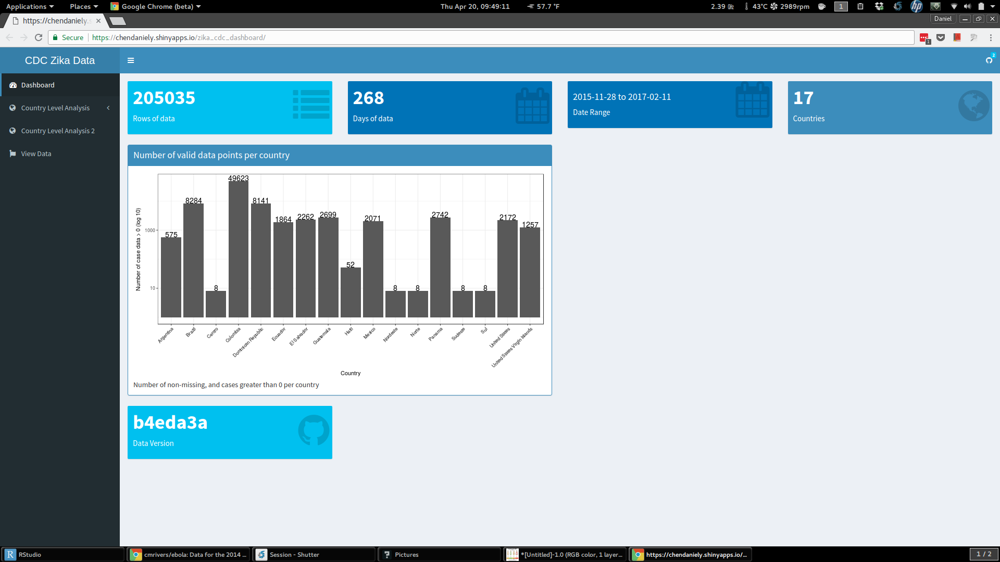

## Open Data Brazil

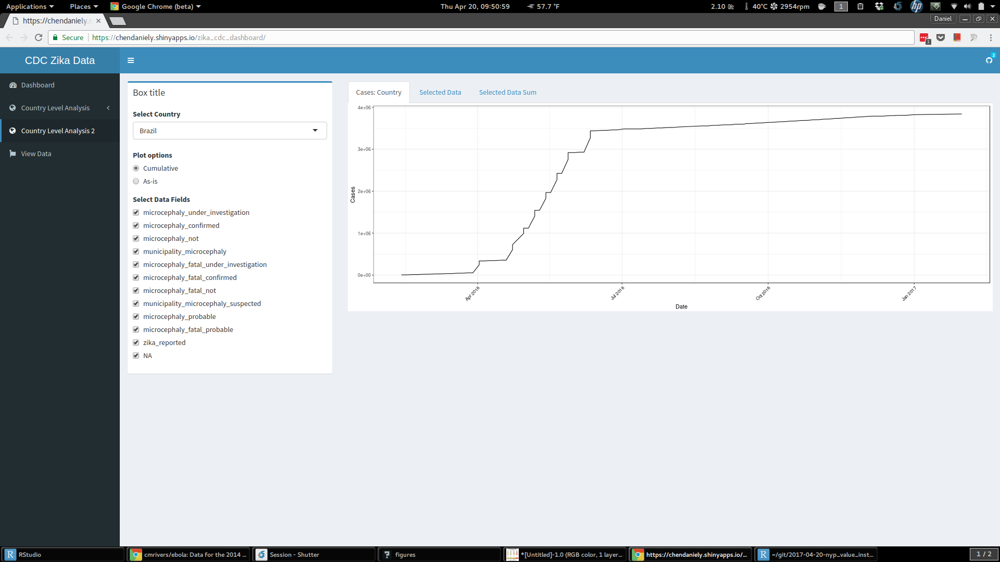

## Scientific Computing

- Software Carpentry
- https://github.com/chendaniely/computational-project-cookie-cutter

- Recent Project
    - https://github.com/chendaniely/collegiate_times_sentiment

## Social and Decision Analytics Lab

<center>

</center>

- Data Science Deployment Infrastructure
    - VirtualBox VMs
    - LXC Containers
    - Docker Containers

## Thanks!

Computational. Network. Epidemiology.

- github: chendaniely
- twitter: chendaniely
- orcid: [orcid.org/0000-0003-3857-1741][14]
- talk: https://github.com/chendaniely/2017-04-20-nyp_value_institute

[1]: http://gbcb.vbi.vt.edu/
[2]: https://www.bi.vt.edu/sdal
[3]: http://kayur.org/
[4]: https://industry.datascience.columbia.edu/profile/rachel-schutt
[5]: http://www.jaredlander.com/
[6]: https://software-carpentry.org/
[7]: http://www.datacarpentry.org/
[8]: http://www.landeranalytics.com/
[9]: https://www.safaribooksonline.com/library/view/git-essentials-livelessons/9780134655284/
[10]: https://www.datacamp.com/courses/cleaning-data-in-python
[11]: https://www.safaribooksonline.com/library/view/pandas-for-everyone/9780134547046/
[12]: https://dib-training.readthedocs.io/en/pub/
[13]: https://pydata.org/
[14]: http://orcid.org/0000-0003-3857-1741
[15]: https://www.nsf.gov/awardsearch/showAward?AWD_ID=1520359
[16]: https://www.bi.vt.edu/sdal/projects/data-science-for-the-public-good-program
[17]: https://github.com/bi-sdal/workshop
[18]: https://github.com/chendaniely/rstatsnyc_2017-data_scientist
[19]: http://blog.iseesystems.com/stella-ithink/limits-to-growth/
